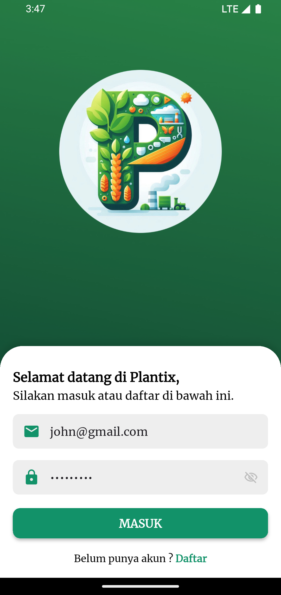
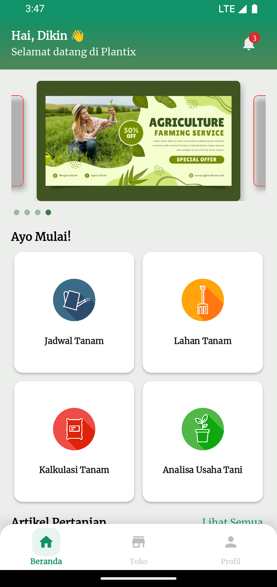
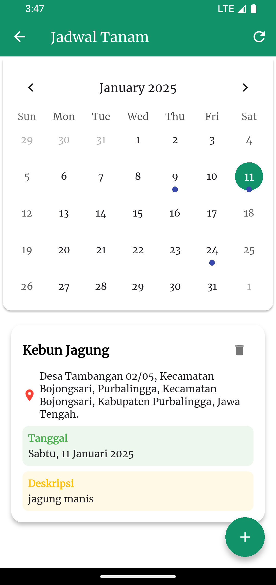
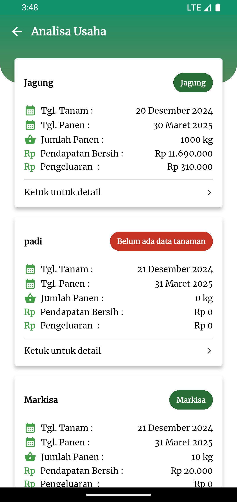
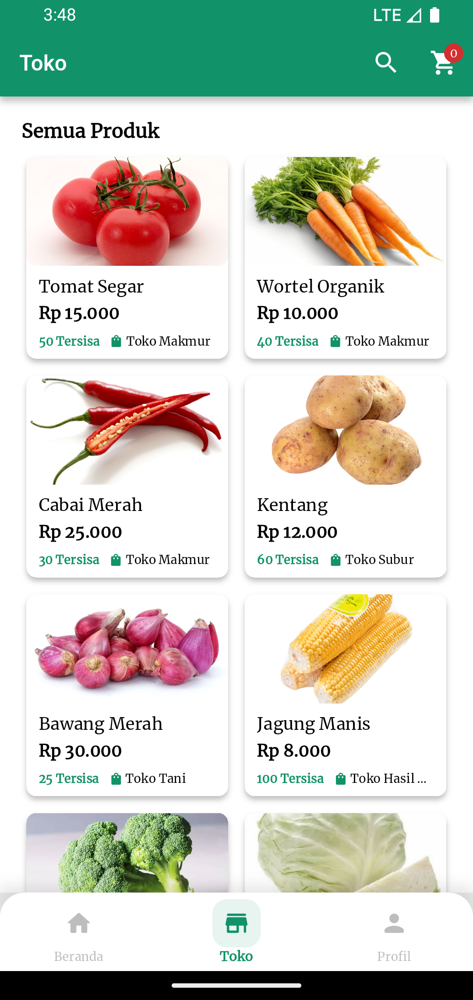
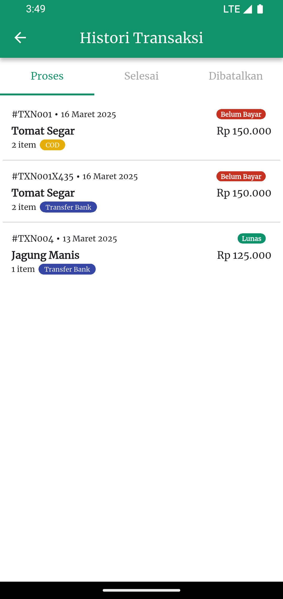
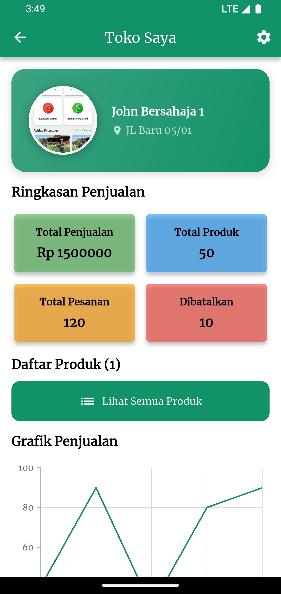

# Plantix: Aplikasi Pertanian Modern

Plantix adalah aplikasi inovatif yang dirancang untuk membantu petani Indonesia memasuki era pertanian digital. Aplikasi ini menggabungkan teknologi modern dengan kearifan lokal untuk meningkatkan produktivitas dan efisiensi dalam sektor pertanian.

## Fitur Utama:

1. **Lahan Tani**:
   Petani dapat dengan mudah membuat, mengelola, dan memantau lahan pertanian mereka. Fitur ini memungkinkan pengguna untuk mencatat detail lahan seperti nama, luas, lokasi, dan jenis tanaman yang ditanam.

2. **Kalkulasi Tanam**:
   Aplikasi menyediakan alat kalkulasi yang membantu petani merencanakan penanaman dengan lebih baik. Fitur ini menghitung kebutuhan benih, pupuk, air, dan pestisida berdasarkan luas lahan dan jenis tanaman. Selain itu, juga memberikan estimasi biaya dan hasil panen.

3. **Analisa Usaha Tani**:
   Memungkinkan petani untuk melacak dan menganalisis pengeluaran serta pendapatan dari setiap lahan. Fitur ini membantu dalam manajemen keuangan dan evaluasi keuntungan usaha tani.

4. **Jadwal Tanam**:
   Menyediakan kalender tanam yang membantu petani mengatur dan mengingat kegiatan pertanian penting seperti waktu tanam, pemupukan, dan panen.

5. **Informasi Produk Pertanian**:
   Menyajikan katalog produk pertanian seperti bibit, pupuk, dan pestisida, memudahkan petani dalam memilih input pertanian yang sesuai.

6. **Profil Pengguna**:
   Memungkinkan petani untuk mengelola informasi pribadi dan preferensi dalam aplikasi.

## Teknologi yang Digunakan:

- **Flutter**: Untuk pengembangan aplikasi lintas platform (Android dan iOS).
- **GetX**: Sebagai state management dan navigasi.
- **API Integration**: Menggunakan Dio untuk komunikasi dengan backend.
- **Penyimpanan Lokal**: Memanfaatkan GetStorage untuk menyimpan data offline.

## Screenshot

|           Screenshot 1            |           Screenshot 2            |           Screenshot 3            |           Screenshot 4            |
| :-------------------------------: | :-------------------------------: | :-------------------------------: | :-------------------------------: |
|  |  |  |  |
|           Screenshot 5            |           Screenshot 6            |           Screenshot 7            |           Screenshot 8            |
|  |  |  |  |

## Memulai

Proyek ini adalah titik awal untuk aplikasi Flutter.

Beberapa sumber daya untuk membantu Anda memulai jika ini adalah proyek Flutter pertama Anda:

- [Lab: Tulis aplikasi Flutter pertama Anda](https://docs.flutter.dev/get-started/codelab)
- [Cookbook: Contoh Flutter yang berguna](https://docs.flutter.dev/cookbook)

Untuk bantuan memulai pengembangan Flutter, lihat
[dokumentasi online](https://docs.flutter.dev/), yang menawarkan tutorial,
contoh, panduan pengembangan seluler, dan referensi API lengkap.
